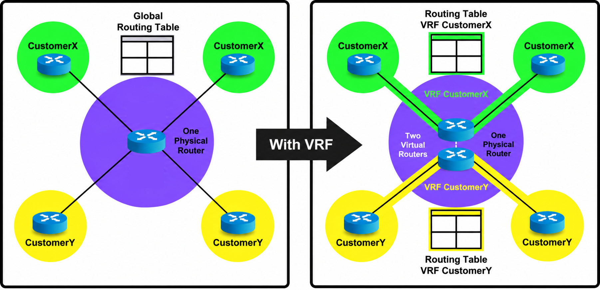

# VRF (Virtual Routing and Forwarding)

## What Is a Routing Table?

Every router, or computer acting as a router, relies on a **routing table** — a list of rules that tells the system exactly where to send data packets based on their destination IP address. Each entry simply states: *"To reach network X, send the packet out interface Y"*. When a packet arrives, the router looks up the destination address in this table, finds the best match, and forwards the packet on its way.

By default, a router has exactly **one** global routing table. Every interface and every network route lives in that single space.

## What Is VRF?

VRF (Virtual Routing and Forwarding) is a technology that allows a single physical router to maintain **multiple independent routing tables** at the same time. By doing this, one physical device behaves as if it were several separate routers.

The following picture shows a before-and-after view:



On the **left side** (without VRF), a service provider has one physical router with a single global routing table. Both CustomerX (green) and CustomerY (yellow) share that same table, so their traffic and routes all mix together.

On the **right side** (with VRF), the same physical router now acts as **two virtual routers**. CustomerX gets its own VRF with its own routing table, and CustomerY gets a separate VRF with its own routing table. Even though there is still only one physical device, each customer's traffic is completely isolated — as if they each had a dedicated router.

### Key Properties of VRF

- Each VRF has its **own routing table** — routes in one VRF are invisible to others.
- Each network interface belongs to **exactly one VRF** at a time. An interface cannot be in two VRFs simultaneously.
- Interfaces not assigned to any VRF belong to the **default VRF** — the original global routing table that every router starts with. Even without any explicit VRF configuration, this single routing domain exists implicitly.
- VRFs share the same physical hardware and operating system — only the routing tables are separated.

## How VRF Works in Practice

When a packet arrives at a router using VRF, a strict sequence happens:

1. **Arrival**: A packet arrives on a specific interface (e.g., eth3).

2. **Identification**: The router determines which VRF that interface belongs to (e.g., `VRF_Guest`).

3. **Isolated Lookup**: The router looks up the destination IP address **only** in the `VRF_Guest` routing table. It completely ignores the global routing table and any other VRFs.

4. **Forwarding or Dropping**: The packet is forwarded out the matching next-hop interface. If no matching route is found in that specific VRF, the packet is **dropped** — even if a valid route exists in a different VRF.

## Why Do We Need VRF?

In a traditional network where all interfaces share one routing table, a few major problems arise:

- **IP Conflicts**: If two different customers or departments use the same IP range (e.g., both use 10.0.0.0/24), the router cannot distinguish their traffic because both routes compete for the exact same table entry.

- **Security Risks**: You might want to guarantee that a guest Wi-Fi network's traffic can never accidentally reach the corporate finance network.

- **Management Lockouts**: If management traffic (like SSH access to the router) mixes with heavy production traffic, a misconfiguration in production could break your ability to log into the router to fix it.

VRF solves these problems by creating total isolation. Because each VRF has its own routing table, overlapping IP addresses are perfectly fine as long as they exist in different VRFs. Routes in one VRF are completely invisible to other VRFs unless you explicitly configure them to share.

## Common Use Cases

### 1. Management VRF

**The most common use case.** Separate management traffic (SSH, SNMP, syslog) from production data traffic:

- **Management VRF:** Contains the out-of-band management port. Routes only to the management network.
- **Default VRF:** Contains all data-plane interfaces. Routes for production traffic.

A routing loop or misconfiguration in production cannot lock you out of the router's management interface.

### 2. Multi-Tenancy

In a shared network, different customers share the same physical routers:

- Each tenant gets their own VRF.
- Tenants can use overlapping IP ranges (e.g., both use `192.168.1.0/24`).
- Traffic isolation is guaranteed — no tenant can see another's traffic.

### 3. Network Segmentation (Security)

Separate sensitive traffic from general traffic:

- **Vrf-pci:** Payment Card Industry traffic, strict firewall rules.
- **Vrf-corp:** Corporate traffic, standard policies.

Routes are shared between them only through explicit, auditable configuration.

### 4. Service Chaining

Route different types of traffic through different network functions (firewalls, load balancers):

- **Vrf-internet:** Routes through the firewall → NAT → internet.
- **Vrf-internal:** Routes directly between internal services.

### 5. Testing and Staging

Run a test environment alongside production on the same router:

- **Default VRF:** Production traffic.
- **Vrf-test:** Staging/test traffic with potentially conflicting IP addresses.


## VRF in the Linux Kernel

The Linux kernel has built-in VRF support (since version 4.3, with full support in 4.8). Each VRF is represented as a special network device tied to its own routing table. The kernel automatically installs routing rules that direct VRF-bound traffic into the correct table, and with a manually added unreachable default route, traffic is prevented from leaking between VRFs.

For the full walkthrough — including IP forwarding, creating VRFs, binding interfaces, connected routes, l3mdev rules, cross-VRF socket access, and kernel isolation mechanics — see **[VRF in the Linux Kernel](vrf-in-linux.md)**.

## VRF and FRR

FRRouting (FRR) is an open-source routing protocol suite that turns a Linux machine into a fully functional router with dynamic routing protocols (BGP, OSPF, and others). FRR has native VRF support — it discovers VRFs from the Linux kernel and can run independent per-VRF routing instances.

For the full discussion — including FRR architecture, how VRF discovery works, per-VRF routing configuration, the route flow from FRR to the kernel, and how VRF separates the RIB and FIB at each layer — see **[VRF and FRR](vrf-and-frr.md)**.

## Route Leaking Between VRFs

By default, VRFs are fully isolated — no traffic crosses boundaries. **Route leaking** is the deliberate act of sharing specific routes between VRFs so that selected hosts or services can communicate across VRF boundaries. Route leaking is always an explicit configuration action — there is no accidental cross-VRF traffic. Route leaking can be done at two levels:

- **Linux kernel** — Using cross-table routes and `ip rule` policy routing. See **[Route Leaking at the Kernel Level](vrf-in-linux.md#route-leaking-at-the-kernel-level)**.

- **FRR** — Using BGP `import vrf` or `nexthop-vrf` static routes. See **[Route Leaking Between VRFs](vrf-and-frr.md#route-leaking-between-vrfs)**.


## VRF-Lite

VRF-lite is VRF **without MPLS**. MPLS (Multiprotocol Label Switching) is a technology used in service provider wide-area networks that forwards packets using short numeric labels instead of performing a full IP lookup at every hop. In a full MPLS/VPN deployment, VRF works together with MPLS label switching and provider-edge signaling to carry customer traffic across a shared backbone. VRF-lite strips away that complexity — each VRF is local to the router with no label distribution or tunneling involved.

VRF-lite is the most common form in **data center and lab environments**, and the form used throughout this documentation and the accompanying lab.


## Frequently Asked Questions

### Q: Is VRF the same as VLAN?

**No.** They operate at different layers:

- **VLAN** (Layer 2) — isolates broadcast domains. Devices in different VLANs cannot communicate at the Ethernet level without a router.
- **VRF** (Layer 3) — isolates routing tables. Devices in different VRFs cannot communicate at the IP level without route leaking.

They are complementary: a VLAN interface — also called an **SVI** (Switch Virtual Interface), the Layer 3 IP interface associated with a VLAN — can be placed in a VRF, giving you Layer 2 isolation within a Layer 3 isolated domain.

### Q: Is VRF the same as a VPN?

**No, but they are related concepts.** A VPN (Virtual Private Network) provides secure, private communication over a shared infrastructure — often using encryption and tunneling across the internet. VRF provides **routing table isolation** within a single device or network, without encryption or tunneling. In service provider networks, MPLS-based VPNs (L3VPN) use VRF at each edge router to keep customer routing tables separate, but VRF itself does not encrypt traffic or create tunnels.

### Q: Is VRF the same as a network namespace?

**No, but they are related.** A Linux network namespace provides **full isolation** — it has its own interfaces, routing tables, firewall rules, and socket space. A VRF is lighter weight: it shares the same namespace but provides **separate routing tables only**. Docker containers use network namespaces. VRF is used within a single namespace to isolate routing domains without the overhead of full namespace separation.

### Q: Does VRF add performance overhead?

**Minimal.** In the Linux kernel, VRF lookups use the standard FIB (Forwarding Information Base) infrastructure with per-table entries — the cost is one additional table lookup. On hardware switches with ASIC support, VRF lookups happen in silicon with no CPU involvement — the only cost is additional TCAM/LPM memory (the ASIC's specialized hardware tables) for each VRF's forwarding table.

### Q: Can interfaces move between VRFs?

**Yes, but it requires reconfiguration.** Moving an interface removes its current IP addresses and routes. You must re-assign them in the new VRF context:

```bash
# Remove IP from current VRF
ip addr del 10.0.0.1/24 dev eth2

# Unbind from current VRF
ip link set eth2 nomaster

# Bind to new VRF
ip link set eth2 master VRF-Red

# Re-assign IP (now in VRF-Red's table)
ip addr add 10.0.0.1/24 dev eth2
```

### Q: What is the maximum number of VRFs?

On Linux, the limit is practical rather than hard-coded — each VRF needs a unique routing table ID (the kernel supports up to 2³² table IDs, minus the four reserved ones). In practice, systems run dozens to hundreds of VRFs without issues. On hardware switches, the limit depends on the ASIC — for example, Mellanox Spectrum-4 supports up to 1000 virtual routers.

### Q: Does the default VRF have a name?

In Linux, the default VRF corresponds to the `main` routing table (table 254). It has no VRF master device — interfaces not bound to any VRF are in the default VRF implicitly. In FRR, the default VRF is the routing instance without a `vrf` qualifier (e.g., `router bgp 65001` with no `vrf` keyword).