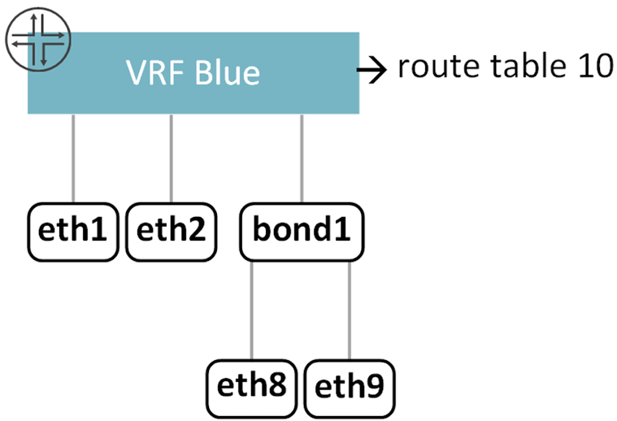
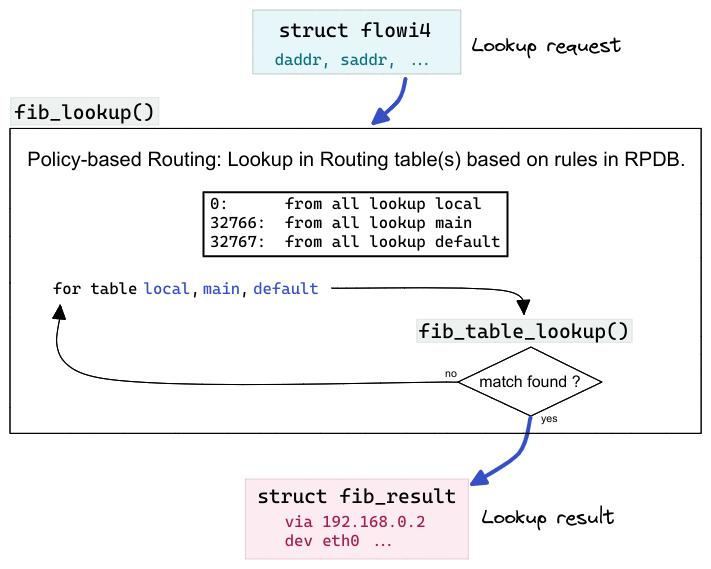

# VRF in the Linux Kernel

> **Prerequisites:** This document assumes familiarity with VRF concepts. See [VRF Fundamentals](vrf-fundamentals.md) for background on routing tables, VRF isolation, and common use cases.


Linux has native VRF support since kernel 4.3 (with full support in 4.8 and later). All VRF management is done through the `ip` command, part of the `iproute2` package that is pre-installed on virtually every Linux distribution.

This document covers everything needed to create, configure, and troubleshoot VRFs on Linux: enabling IP forwarding, creating VRF devices, binding interfaces, understanding how the kernel routes VRF traffic, and isolating routing tables. Each section builds on the previous one, so reading in order is recommended.

> **Note on persistence:** All `ip link`, `ip addr`, `ip route`, and `ip rule` commands shown in this document take effect immediately but do **not** survive a reboot. To make VRF configuration persistent, add the commands to a startup script, use `systemd-networkd`, or configure them through a network management tool such as `netplan` or `NetworkManager`. The `sysctl` settings can be made persistent by adding them to `/etc/sysctl.conf` and running `sudo sysctl -p`.

## VRF Master Devices and Enslaved Interfaces

In the Linux kernel, each VRF is implemented as a special network device called a **VRF master device**. This is not a physical device — it is a virtual device that represents a routing domain. Regular network interfaces (such as `eth0`, `bond0`, or `dummy0`) can be bound to a VRF master device. Once bound, they are called **enslaved interfaces**, and all traffic on them is routed using the VRF's own kernel routing table — identified by a numeric **table ID**.

The following diagram shows this structure. The VRF master device (`VRF Blue`) is associated with kernel routing table 10. Three interfaces are bound to it: `eth1`, `eth2`, and `bond1`. The bond interface itself aggregates two physical interfaces (`eth8` and `eth9`). All traffic arriving on any of these interfaces is routed using table 10 — completely isolated from the default VRF and any other VRFs on the system.



The kernel automatically installs a routing rule that directs VRF-bound traffic into the correct table (explained in [Kernel Routing Rules](#kernel-routing-rules-l3mdev) below). With a manually added unreachable default route (explained in [The Unreachable Default Route](#the-unreachable-default-route) below), each VRF's traffic is fully isolated.

## IP Forwarding

By default, Linux behaves as a host, not a router — it **drops** packets that arrive on one interface and are destined for another. For a VRF router to forward packets between its interfaces, you must enable **IP forwarding**:

```bash
# Enable IPv4 forwarding (takes effect immediately)
sudo sysctl -w net.ipv4.ip_forward=1

# Enable IPv6 forwarding (if your network uses IPv6)
sudo sysctl -w net.ipv6.conf.all.forwarding=1
```

Without this setting, a VRF router receives packets from hosts but silently drops them — even if the routing table has the correct entries. This is one of the most common reasons for routing failures in lab setups.

To check whether IP forwarding is currently enabled:

```bash
sysctl net.ipv4.ip_forward
# net.ipv4.ip_forward = 1   means enabled
# net.ipv4.ip_forward = 0   means disabled (packets will be dropped)
```

To make the setting persistent across reboots, add the following to `/etc/sysctl.conf`:

```
net.ipv4.ip_forward = 1
net.ipv6.conf.all.forwarding = 1
```

Then apply without rebooting:

```bash
sudo sysctl -p
```

## Creating Interfaces for Lab Use

Most machines do not have spare physical network interfaces available for VRF experiments. Linux provides **dummy interfaces** — lightweight virtual network devices that behave like real interfaces for IP assignment, VRF binding, and routing, but are not connected to any physical network.

```bash
# Create two dummy interfaces
sudo ip link add dummy0 type dummy
sudo ip link add dummy1 type dummy
```

These are sufficient for everything in this document. All the examples below use dummy interfaces.


## Creating a VRF

```bash
# Create a VRF named VRF-Blue with routing table ID 1001
sudo ip link add VRF-Blue type vrf table 1001

# Bring the VRF device up (enables it to process traffic)
sudo ip link set VRF-Blue up
```

This creates:
- A new network device `VRF-Blue` of type `vrf`.
- An association between `VRF-Blue` and kernel routing table `1001`.

Any interfaces later bound to `VRF-Blue` will use table `1001` for all route lookups.

The table ID (`1001`) is an arbitrary number you choose. Each VRF must use a **unique** table ID. Avoid the following reserved table IDs — they are used by the kernel:

| Table ID | Name    | Purpose                              |
|----------|---------|--------------------------------------|
| `0`      | unspec  | Unspecified — used internally by the kernel |
| `253`    | default | Default routing table (typically empty) |
| `254`    | main    | Main routing table — where routes go by default |
| `255`    | local   | Local addresses and broadcast routes (managed automatically) |

When you create a VRF:

- ✅ The kernel creates the VRF master device and associates it with the specified table.
- ✅ The kernel installs an **l3mdev routing rule** that directs VRF-bound traffic into the correct table (see [Kernel Routing Rules](#kernel-routing-rules-l3mdev)).
- ❌ The kernel does **not** install a default route in the VRF's table. You must manually add an **unreachable default route** to prevent unmatched traffic from leaking into the `main` table (see [The Unreachable Default Route](#the-unreachable-default-route)).

### Naming Table IDs

By default, commands like `ip route show table 1001` display the raw numeric ID. You can assign human-readable names by adding entries to `/etc/iproute2/rt_tables`:

```
# /etc/iproute2/rt_tables
1001    VRF-Blue
1002    VRF-Red
```

After adding these entries, you can use the names interchangeably with numeric IDs:

```bash
ip route show table VRF-Blue   # same as: ip route show table 1001
```

This is purely cosmetic — it does not change how the kernel operates.


## Binding Interfaces to a VRF

Binding an interface to a VRF assigns it to that VRF's routing domain. After binding, all routes associated with the interface are placed in the VRF's routing table instead of the default `main` table.

> **⚠ Warning:** Binding an interface to a VRF **removes any previously assigned IP addresses**. Always follow this order:
> 1. Bind the interface to the VRF (`ip link set ... master ...`)
> 2. Assign IP addresses (`ip addr add ...`)
> 3. Bring the interface up (`ip link set ... up`)

```bash
# 1. Bind dummy0 to VRF-Blue
sudo ip link set dummy0 master VRF-Blue

# 2. Assign an IP address (its route goes into VRF-Blue's table)
sudo ip addr add 10.0.0.1/24 dev dummy0

# 3. Bring the interface up
sudo ip link set dummy0 up
```

After binding, `dummy0` is an enslaved interface of the `VRF-Blue` master device. Any route associated with `dummy0` is automatically placed in table `1001`.


## Connected Routes

When you assign an IP address to a VRF-bound interface, the kernel automatically creates a **connected route** in that VRF's routing table. For example:

```bash
sudo ip addr add 10.0.0.1/24 dev dummy0   # dummy0 is in VRF-Blue
```

This automatically adds a route for `10.0.0.0/24` via `dummy0` in table `1001`. You do not need to add this route manually — it appears because the interface has an address in that subnet.

Connected routes are the most basic building blocks of a VRF's routing table. They tell the router: *"I am directly attached to this network through this interface."*

To view the connected route that was created:

```bash
ip route show vrf VRF-Blue
# 10.0.0.0/24 dev dummy0 proto kernel scope link src 10.0.0.1
```

Reading this output from left to right:

| Field          | Meaning |
|----------------|---------|
| `10.0.0.0/24`  | The destination network this route covers |
| `dev dummy0`   | Packets matching this route are sent out through `dummy0` |
| `proto kernel` | This route was created automatically by the kernel (not manually or by a routing protocol) |
| `scope link`   | The destination is directly reachable on the local link (no intermediate router needed) |
| `src 10.0.0.1` | When originating packets to this network, use `10.0.0.1` as the source IP address |


## Kernel Routing Rules (l3mdev)

The previous sections showed how to create a VRF and place routes in its table. But how does the kernel know *which* table to search when a packet arrives? The answer is **Policy-Based Routing (PBR)** and a special rule called the **l3mdev rule**. The name l3mdev stands for **Layer 3 Master Device** — the kernel's internal name for a VRF master device.

### How Route Lookups Work Without VRF

The kernel maintains a **Routing Policy Database (RPDB)** — an ordered list of rules that tells the kernel which routing table to search for each packet. You can view these rules with:

```bash
ip rule show
```

On a system with no VRFs, the default RPDB contains three rules:

```
0:      from all lookup local
32766:  from all lookup main
32767:  from all lookup default
```

The kernel evaluates these rules **in order of priority** (the number before the colon — lower numbers are checked first). For each rule, if the packet matches the rule's conditions, the kernel searches the specified table. If a matching route is found, the lookup is complete. If not, the kernel moves on to the next rule.

| Priority | Rule | Purpose |
|----------|------|---------|
| `0` | `lookup local` | Checks the `local` table — matches packets destined to the machine's own IP addresses (loopback, local interfaces). This ensures locally-addressed traffic is handled before anything else. |
| `32766` | `lookup main` | Checks the `main` routing table — where all normal routes live (e.g., your default gateway, static routes, connected routes). |
| `32767` | `lookup default` | Checks the `default` table as a last resort. This table is typically empty. |

The following diagram shows this flow. A lookup request enters the RPDB. For each rule, the kernel searches the specified table. If a match is found, the result is returned. If not, the next rule is tried.



This is how **all** Linux route lookups work — with or without VRF. Every packet goes through this RPDB rule evaluation.

### What Changes When You Create a VRF

When the first VRF device is created, the kernel automatically inserts a new rule into the RPDB at priority `1000`:

```
0:      from all lookup local
1000:   from all lookup [l3mdev-table]    ← new
32766:  from all lookup main
32767:  from all lookup default
```

You can verify this by running `ip rule show` after creating any VRF.

This `l3mdev-table` rule is the mechanism that makes VRF routing work. Unlike the other rules, it does not point to a fixed table. Instead, it is **dynamic**: for each packet, it checks whether the packet's interface has a VRF master device. If it does, the rule redirects the lookup into that VRF's routing table. If not, the rule is skipped entirely and the kernel moves on to the next rule (`main`).

A single l3mdev rule handles **all** VRFs on the system — regardless of how many exist. You do not need one rule per VRF. Here is how the same rule list handles two different packets:

- **Packet arrives on `dummy0`** (bound to VRF-Blue): Rule 0 — not local, skip. Rule 1000 — `dummy0` has a VRF master → **match**, look up routes in VRF-Blue's table. If a route is found (including the unreachable default), the lookup is complete — the packet **never reaches `main`**.

- **Packet arrives on `ens18`** (not in any VRF): Rule 0 — not local, skip. Rule 1000 — `ens18` has no VRF master → **does not apply**, skip. Rule 32766 — **match**, look up routes in the `main` table (where the default gateway lives).

The l3mdev rule is installed automatically when the first VRF is created — you do not need to add it manually.


## The Unreachable Default Route

The l3mdev rule (previous section) ensures that VRF-bound traffic is looked up in the VRF's routing table. However, the l3mdev rule operates within the kernel's PBR framework. In PBR, when a rule directs a lookup into a table but no matching route is found, the kernel does not stop — it **continues to the next rule**. Looking at the rule list:

```
0:      from all lookup local
1000:   from all lookup [l3mdev-table]    ← VRF lookup happens here
32766:  from all lookup main              ← falls through to here if no match
32767:  from all lookup default
```

If the VRF's routing table has no route for a packet's destination, the lookup falls through to rule 32766 — the `main` table. If the `main` table has a matching route (e.g., a default gateway), the packet is forwarded using that route, **breaking VRF isolation**.

To prevent this, the [kernel VRF documentation](https://docs.kernel.org/networking/vrf.html) specifies that you must manually add an **unreachable default route** to each VRF's routing table:

```bash
sudo ip route add table 1001 unreachable default metric 4278198272
```

This route acts as a catch-all at the bottom of the VRF's table. Because the unreachable route always matches (it is a default route), the PBR lookup returns a result — "destination unreachable" — and **stops**. The kernel never falls through to `main`. Any packet that hits this route is dropped, and if it was locally generated, the sender receives an ICMP "Network is unreachable" error.

> **⚠ Important:** The kernel does **not** install this route automatically. You must add it yourself for each VRF. Without it, unmatched traffic can leak into the `main` table. This is a common source of subtle VRF isolation failures.

### Why This Specific Metric?

A route's **metric** (also called **priority**) is a numeric value that determines which route the kernel prefers when multiple routes match the same destination — lower metric values are preferred. The metric `4278198272` (hex `0xFF002000`) is chosen for compatibility with FRRouting (FRR), the open-source routing suite described in [VRF and FRR](vrf-and-frr.md). FRR interprets kernel route metrics as a combined **administrative distance** (upper byte) and **priority** (lower 3 bytes):

| Component | Value | Meaning |
|-----------|-------|---------|
| Admin distance | `0xFF` = 255 | Lowest possible priority in FRR's route selection |
| Route priority | `0x002000` = 8192 | Low priority within the same admin distance |

This ensures that any route installed by FRR (which defaults to metric 20) or manually by the user will always take precedence over the unreachable fallback. If you later add a real default route for the VRF, it overrides the unreachable entry:

```bash
sudo ip route add default via 192.168.1.1 table 1001
```


## How the Kernel Enforces Isolation

The previous sections described the l3mdev rule and the unreachable default route individually. Here is how they work together as a complete isolation mechanism when a packet arrives on a VRF-bound interface:

1. The kernel identifies the interface's VRF master device.
2. The **l3mdev rule** redirects the route lookup to the VRF's table (e.g., table `1001`).
3. If a matching route is found, the packet is forwarded accordingly.
4. If no specific route matches, the **unreachable default route** rejects the packet. PBR rule processing stops — the `main` table is never consulted.

Both mechanisms are required. The l3mdev rule alone is not enough because PBR would fall through to `main` on a miss. This means two VRFs can both have a route for `10.0.0.0/24` pointing to completely different next hops, and there is no conflict — they live in separate tables.


## Viewing VRF State

```bash
# List all VRF devices and their table IDs
ip vrf show

# Show the routing table for a specific VRF
ip route show vrf VRF-Blue

# Show interfaces bound to a VRF
ip link show master VRF-Blue

# Show the kernel routing rules (look for the l3mdev rule at priority 1000)
ip rule show

# Inspect a routing table directly by ID
ip route show table 1001

# Compare with the main (default VRF) table
ip route show table main
```


## Running Commands in a VRF Context

Linux lets you run any command within a specific VRF's network context:

```bash
# Ping through a specific VRF (binds the socket to the VRF device)
sudo ping -I VRF-Blue 10.0.0.2

# Run any command in VRF context
sudo ip vrf exec VRF-Blue ssh user@10.0.0.2
sudo ip vrf exec VRF-Blue traceroute 10.0.0.2
```

The `ip vrf exec` command runs a process with its network operations scoped to the specified VRF. This is useful for diagnostics — you can test connectivity from the perspective of a specific VRF, even from the router itself. The `sudo` is required because `ip vrf exec` uses Linux network namespaces internally, which needs root privileges.


## Cross-VRF Socket Access

By default, a server listening on a port (e.g., SSH on port 22) in the default VRF can only accept connections from the default VRF. Connections arriving on VRF-bound interfaces are rejected.

Linux provides sysctls (since kernel 4.5) that allow server sockets to accept connections from **any** VRF:

```bash
# Allow TCP servers in the default VRF to accept connections from all VRFs
sudo sysctl -w net.ipv4.tcp_l3mdev_accept=1

# Allow UDP servers in the default VRF to accept connections from all VRFs
sudo sysctl -w net.ipv4.udp_l3mdev_accept=1
```

When `tcp_l3mdev_accept` is set to `1`, a service like SSH listening on `0.0.0.0:22` in the default VRF can accept connections arriving on any VRF's interfaces. Once a connection is established, it is automatically scoped to the VRF of the incoming interface — reply packets are routed through the correct VRF table. This means services like SSH can serve multiple VRFs without running separate instances per VRF.

To make these settings persistent across reboots, add them to `/etc/sysctl.conf`:

```
net.ipv4.tcp_l3mdev_accept = 1
net.ipv4.udp_l3mdev_accept = 1
```

> **Note:** These sysctls control **socket binding behavior**, not route lookups. They do not cause VRF routing tables to fall back to the `main` table. Route isolation remains fully intact regardless of these settings.


## Complete Example: Two VRFs from Scratch

This example brings together all the preceding sections into a single copy-paste workflow. It creates two isolated VRFs on a single Linux machine, each with its own interface and routing table:

```bash
# 1. Enable IP forwarding
sudo sysctl -w net.ipv4.ip_forward=1

# 2. Create two VRFs with distinct table IDs
sudo ip link add VRF-Blue type vrf table 1001
sudo ip link add VRF-Red  type vrf table 1002
sudo ip link set VRF-Blue up
sudo ip link set VRF-Red  up

# 3. Add unreachable defaults to prevent leaking into the main table
sudo ip route add table 1001 unreachable default metric 4278198272
sudo ip route add table 1002 unreachable default metric 4278198272

# 4. Create dummy interfaces (if you do not have spare physical interfaces)
sudo ip link add dummy0 type dummy
sudo ip link add dummy1 type dummy

# 5. Bind interfaces to their respective VRFs (must come before IP assignment)
sudo ip link set dummy0 master VRF-Blue
sudo ip link set dummy1 master VRF-Red

# 6. Assign IP addresses (after binding — binding removes existing IPs)
sudo ip addr add 10.0.1.1/24 dev dummy0
sudo ip addr add 10.0.2.1/24 dev dummy1

# 7. Bring interfaces up
sudo ip link set dummy0 up
sudo ip link set dummy1 up
```

After these steps, `dummy0` (10.0.1.1/24) is in VRF-Blue and `dummy1` (10.0.2.1/24) is in VRF-Red. The two VRFs are completely isolated — traffic on `dummy0` cannot reach `dummy1` through IP routing, even though both interfaces are on the same physical machine.


## Route Leaking at the Kernel Level

When the unreachable default route is installed (as described earlier), VRFs are fully isolated — unmatched packets are dropped rather than leaked. However, you can deliberately share specific routes between VRFs using kernel routing tools.

### Method 1: Cross-Table Route

Install a route in one VRF's table that points to a device belonging to another VRF:

```bash
# In VRF-Blue's table (1001), add a route for VRF-Red's subnet
# dummy1 belongs to VRF-Red
sudo ip route add 10.0.2.0/24 dev dummy1 table 1001
```

This tells the kernel: *"When VRF-Blue needs to reach 10.0.2.0/24, send packets out dummy1"* — even though `dummy1` belongs to VRF-Red. The route exists in table 1001, but the egress interface is in table 1002.

For bidirectional access, add the reverse route as well:

```bash
sudo ip route add 10.0.1.0/24 dev dummy0 table 1002
```

### Method 2: Policy Routing with `ip rule`

Use `ip rule` to selectively redirect specific traffic from one VRF's table into another:

```bash
# Packets from 10.0.1.0/24 should also look up VRF-Red's table
sudo ip rule add from 10.0.1.0/24 lookup 1002
```

This inserts a policy rule that matches packets by source address and redirects them to a different routing table for the lookup. This method is flexible — you can match on source address, destination address, or firewall mark — but it bypasses the l3mdev framework, so use it carefully.

### Removing Leaked Routes

```bash
# Remove a cross-table route
sudo ip route del 10.0.2.0/24 dev dummy1 table 1001

# Remove a policy rule
sudo ip rule del from 10.0.1.0/24 lookup 1002
```

After removal, VRF isolation is fully restored.

> **Note:** Kernel-level route leaking works but is fragile — routes and rules are not persisted across reboots (unless scripted), and they are harder to audit than FRR configuration. For anything beyond a quick one-off route, FRR's BGP `import vrf` or `nexthop-vrf` static routes are more manageable. See [Route Leaking in FRR](vrf-and-frr.md#route-leaking-between-vrfs) for those methods.


## Deleting a VRF

To remove a VRF, delete its master device:

```bash
sudo ip link del VRF-Blue
```

This:
- Removes the `VRF-Blue` network device.
- Releases all enslaved interfaces back to the default VRF.
- Removes all routes from the VRF's routing table (table `1001`).

Note that released interfaces lose their IP addresses. You must re-assign IPs if you want them to function in the default VRF.
